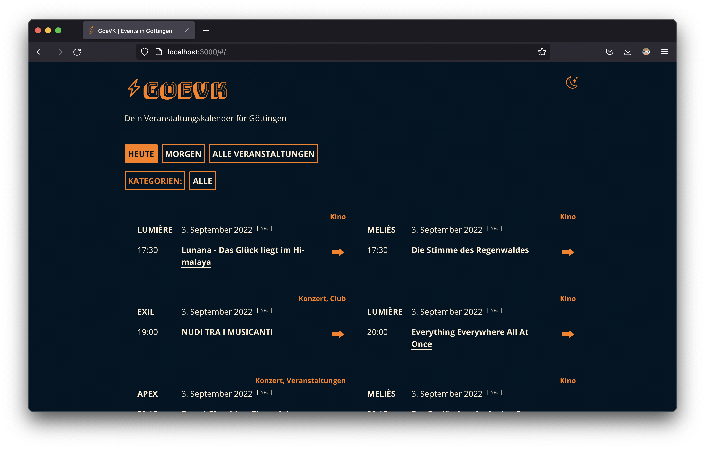

# GOEVK Frontend

A React app providing a frontend for `GOEVK - Dein Veranstaltungskalender für Göttingen`. It was bootstrapped with [Create React App](https://github.com/facebook/create-react-app).

This project displays and filters data on events taking place in [Goettingen](https://en.wikipedia.org/wiki/G%C3%B6ttingen), a university town in Lower Saxony, Germany. The data is scraped and served by the [GOEVK api](https://github.com/xylnx/goevk-api).

  

  

## Available Scripts

`npm start`

Run the app locally

`npm run build`

Build the app for production.

`npm run deploy`

Build the app and deploy using [gh-pages](https://github.com/tschaub/gh-pages).

`npm run devServer`

Start a local api service for testing. Requires [json-server](https://github.com/typicode/json-server).
